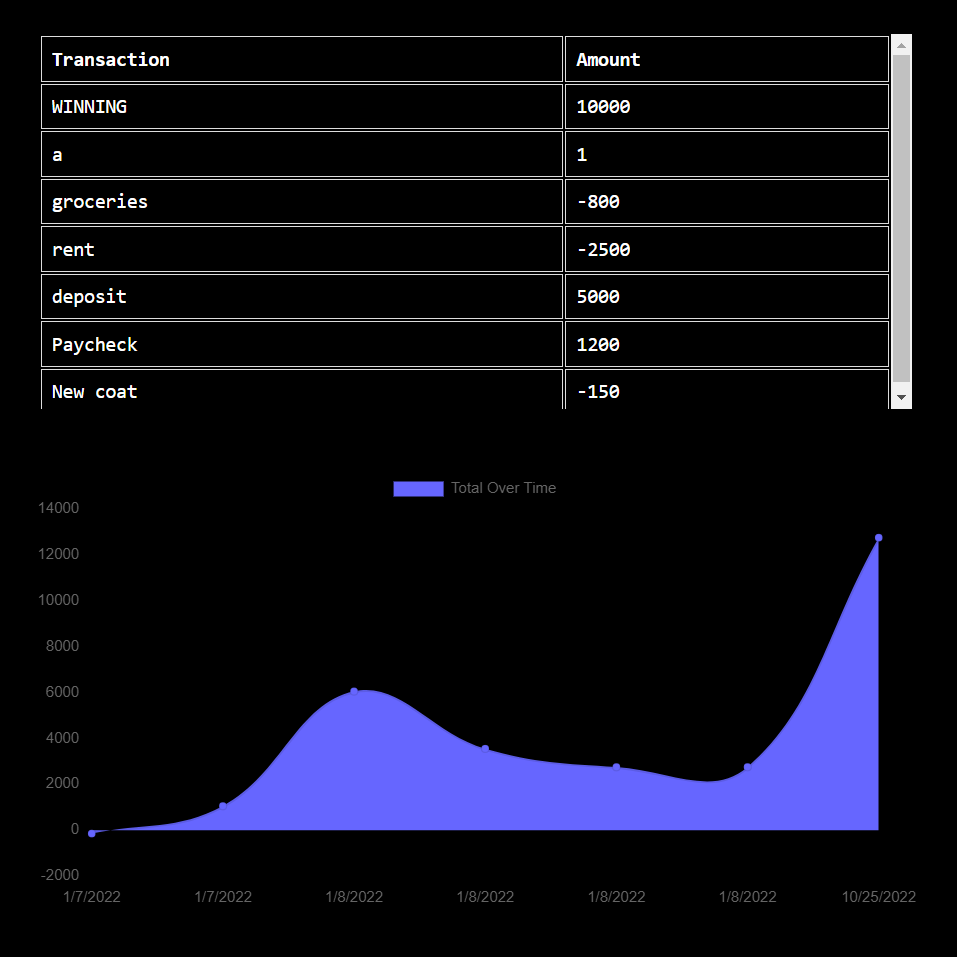

# 🪙 PennyPinch 🪙

### A minimal helper-bot for the save-savvy

> **||PennyPinch||** >  

## _DESCRIPTION_

> PennyPinch is an easy-to-use budget-tracking app with a focus on delivering full progressive web app functionality.
>
> > > 

---

## _Table of Contents_

### (_Internal navigation links_)

- [Installation](#installation)
- [Usage](#usage)
- [Features](#features)
- [Credits](#credits)
- [Live](#live)

> _Note: The click-through links contained within the discussion sections may send you to an external site._  

---

---

---

> - ### **INSTALLATION**
>   > > _Cloning for investigation and collaboration_  
>   > >
>   > > > These steps assume familiarity with Node.js, GitHub repo management, and the command line.
>   > >
>   > > - Clone the repo to your local machine @ [PennyPinch Repo](https://github.com/JaynewDee/PennyPinch)
>   > > - Run npm start from the command line at the root level of the repo's directory.

---

---

---

> - ### **USAGE**
>   > > _Tracking your budget_  
>   > >
>   > > > - Enter a name for your transaction.
>   > > > - Enter the amount of the transaction, either paid or received, as a whole number.
>   > > > - Click Add Funds or Substract Funds, depending on the type of transaction.
>   > > > - That's it! View your transaction history as a dynamic list and a chart visualization tracking your spending over time.

---

> > > > 

---

---

---

> - ### **FEATURES**
>   > > _Under the Hood_  
>   > >
>   > > > - Service worker manages static files for optimizing performance and for offline usability.
>   > > > - Utilizes indexedDB to interface with the database and synergize data both on and off network.
>   > > > - Uses Express.js for server routing.
>   > > > - Uses MongoDB and Mongoose to give database NoSQL structure with relational capacity.
>   > > > - Packaged for bundled distrubtion using webpack.
>   > > > - _Under development:_ Achieve installability by meeting all PWA standards.

---

---

---

> - ### **LIVE**
>   > > _The App in its natural state_  
>   > >
>   > > > [PennyPinch Deployed](https://shrouded-cove-84026.herokuapp.com/)

---

---

---

## About the Creator

> ### _Joshua Newell Diehl_
>
> > > is a budding developer currently based in Ft Worth, Texas. He enjoys coding, long romantic hours dead asleep, walks with his dog Margot, and _creepily_ referring to himself in third person.
> >
> > > And here is where you can reach him [||](https://developer.mozilla.org/en-US/docs/Web/JavaScript/Reference/Operators/Logical_OR "Javascript OR Operator") review the work he's been doing:
> > >
> > > [GitHub](https://github.com/JaynewDee "Repositories authored by Joshua Newell Diehl")  
> > > [Email](mailto:jdiehl2236@gmail.com)  
> > > [Portfolio](https://syntheticrain.net/)
> > >
> > > > ~ _Let's build something awesome._
