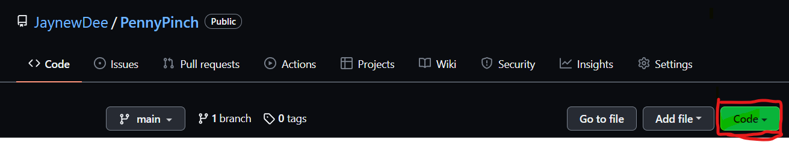

#   🪙 PennyPinch 🪙

### A minimal helper-bot for the save-savvy  
> **||PennyPinch||** 
   

## *DESCRIPTION* 
> PennyPinch is an easy-to-use budget-tracking app with a focus on delivering full progressive web app functionality.
>  
>>>  
___  

## *Table of Contents*
### (*Internal navigation links*)
- [Installation](#installation)
- [Usage](#usage)
- [Features](#features)
- [Credits](#credits)
- [Live](#live)

> *Note: The click-through links contained within the discussion sections may send you to an external site.*  
___  
___
___
> - ### **INSTALLATION**
>>>  *Cloning for investigation and collaboration*  
>>>>  These steps assume familiarity with Node.js, GitHub repo management, and the command line.
>>>  - Clone the repo to your local machine @ [PennyPinch Repo](https://github.com/JaynewDee/PennyPinch)
>>>  - Run npm start from the command line at the root level of the repo's directory.  
___  
>>>> 
___  
___
___  
> - ### **USAGE**
>>>  *Tracking your budget*  
>>>>  - Enter a name for your transaction.
>>>>  - Enter the amount of the transaction, either paid or received, as a whole number.
>>>>  - Click Add Funds or Substract Funds, depending on the type of transaction.  
>>>>  - That's it!  View your transaction history as a dynamic list and a chart visualization tracking your spending over time.
___  
>>>> 
___  
___
___  
> - ### **FEATURES**
>>>  *Under the Hood*  
>>>> - Service worker manages static files for optimizing performance and for offline usability.
>>>> - Utilizes indexedDB to interface with the database and synergize data both on and off network.
>>>> - Uses Express.js for server routing.
>>>> - Uses MongoDB and Mongoose to give database NoSQL structure with relational capacity.
>>>> - Packaged for bundled distrubtion using webpack.  
>>>> - *Under development:* Achieve installability by meeting all PWA standards.  
___  
>>>> 
___  
___
___  
> - ### **CREDITS**
>>>  *Contributions |&&| Honorable Mentions*  
>>>>  SMU Coding Boot Camp, for front-end starter code and indispensable knowledge relation.
___  
___
___  
> - ### **LIVE**
>>>  *The App in its natural state*  
>>>>  [PennyPinch Deployed](https://shrouded-cove-84026.herokuapp.com/)
___  
___
___  

## About the Creator

> ### *Joshua Newell Diehl*
>>>  
>>> is a budding developer currently based in Ft Worth, Texas.  He enjoys coding, long romantic hours dead asleep, walks with his dog Margot, and *creepily* referring to himself in third person.  
>>>>  
>>>> Here are a few of his favorite technologies at the moment:
>>>> - [Tailwind.css](https://tailwindcss.com/)
>>>> - [React.js](https://reactjs.org/)  
>>>> - [MongoDB](https://www.mongodb.com/)  
>>>> - [Express.js](https://expressjs.com/)

>>>>  
>>  
>>> And here is where you can reach him [||](https://developer.mozilla.org/en-US/docs/Web/JavaScript/Reference/Operators/Logical_OR 'Javascript OR Operator') review the work he's been doing:   
>>>
>>> [GitHub](https://github.com/JaynewDee 'Repositories authored by Joshua Newell Diehl')  
>>> [Email](mailto:jdiehl2236@gmail.com)  
>>> [Portfolio](https://jaynewdee.github.io/Personal-Portfolio-Bluev2/)
>>>
>>>> ~ *Let's build something awesome.*